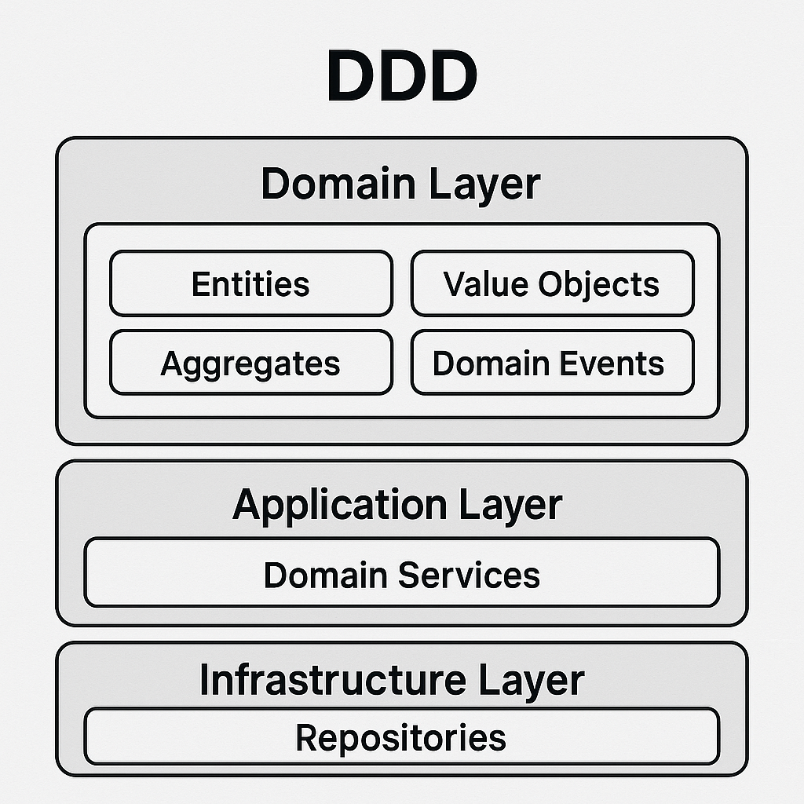
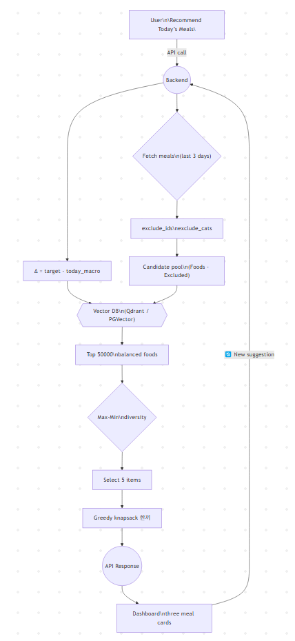

# 한끼위키 (Hankki Wiki) 🍽️  
**SSAFY 13기 서울 10반 관통 프로젝트**

RAG 기법을 활용한 AI 기반 개인 맞춤형 식사 추천 서비스

* * *

## 📋 프로젝트 개요  
현대인들이 매일 겪는 **"오늘 뭐 먹지?"**라는 고민을 해결하기 위한 AI 기반 개인 맞춤형 식사 추천 서비스입니다. 사용자의 건강 정보, 최근 식단 기록, 개인 선호도를 종합적으로 분석하여 영양 균형을 고려한 식사를 추천합니다.

## 🎯 프로젝트 배경  
### 현대인의 식사 고민  
- 매일 아침 '오늘 뭐 먹지?' 고민  
- 하루 평균 3번 이상 메뉴 선택으로 인한 스트레스  
- 메뉴 고르는 시간이 식사 시간보다 길어지는 현상  
- 바쁜 직장인과 건강 관리자에게 큰 부담  

### 건강한 식습관의 어려움  
- 잦은 외식과 배달로 인한 영양 불균형  
- 건강에 대한 관심 증가 vs 실천의 어려움  
- 개인 맞춤 식단 필요성 증가  
- 시간 부족으로 인한 편의성 추구  

* * *

## 👤 페르소나: 장세림  
**기본 정보**  
- 26세 여성, 경기도 거주  
- 서울 소재 금융권 회사 사원  
- 바쁜 평일 점심은 사내 식당이나 편의점 이용  
- 출퇴근 지하철 통근, 아침 식사 건너뜀  

**페인 포인트**  
- "영양소는 챙기고 싶은데 귀찮다"  
- "뭘 먹어야 할지 모르겠고, 맨날 똑같은 것만 먹는다"  

* * *

## 🏗️ 기술 스택  

**Frontend**  
- HTML/CSS/JavaScript  
- Bootstrap - 반응형 UI 구현  
- Chart.js - 영양소 데이터 시각화  

**Backend**  
- Spring Boot - 메인 프레임워크  
- Spring Security + JWT - 인증 및 보안  
- JPA/Hibernate - 데이터베이스 ORM  
- MySQL - 메인 데이터베이스  
- Redis - 벡터 저장 및 캐싱  

**AI & Data Processing**  
- OpenAI GPT API - 자연어 처리 및 추천 생성  
- PCA (주성분 분석) - 차원 축소  
- KNN (K-최근접 이웃) - 유사도 기반 추천  
- Full-text Index - 고성능 검색  

* * *
## 전체 아키텍처 패턴 
### Domain-Driven Design (DDD) + Hexagonal Architecture

<p align="center"> 
  
</p>

```text
📂 domain 구조가 완벽한 DDD 적용 사례:
├── auth (인증 도메인)
├── diary (일기 도메인) 
├── diet (식단 도메인)
├── food (음식 도메인)
├── recommend (추천 도메인)
├── user (사용자 도메인)
└── vector (벡터 검색 도메인)
```
### Clean Architecture + Layered Architecture 융합
```text
// 각 도메인 내 계층 구조
📂 auth/
├── 📂 controller/     // Interface Adapters Layer
├── 📂 dto/           // Application Layer
├── 📂 entity/        // Domain Layer  
├── 📂 repository/    // Infrastructure Layer
└── 📂 service/       // Application Layer
```

### Redis Vector Database 활용
```text
📂 vector/
├── 📂 redis/config/
│   ├── 📜 RedisConfig.java                    // Redis 설정
│   └── 📜 RedisVectorIndexInitializer.java    // 벡터 인덱스 초기화
├── 📂 service/
│   └── 📜 FoodVectorService.java              // 벡터 서비스 계층
└── 📂 util/
    ├── 📜 RedisVectorSearcher.java            // 벡터 검색 엔진
    └── 📜 RedisVectorUtil.java                // 벡터 유틸리티
```

### 보안 아키텍처: JWT+Spring Security 통합
```text
📂 auth/
├── 📜 AuthController.java          // 인증 엔드포인트
├── 📜 TokenService.java           // JWT 생성/검증
├── 📜 RefreshTokenService.java    // 리프레시 토큰 관리
└── 📜 AuthUserDetailsService.java // 사용자 상세정보 로드
```

### 마이크로서비스 지향 설계
```text
// 각 도메인별 완전한 독립성
📂 auth/     → 인증/인가 서비스
📂 diet/     → 식단 관리 서비스  
📂 food/     → 음식 정보 서비스
📂 recommend/ → 추천 서비스
📂 vector/   → 벡터 검색 서비스
```

### 데이터 아키텍처: Entity Relationship 최적화
```text
📜 User.java ←→ UserHealthInfo.java     // 1:1 관계
📜 DietGroup.java ←→ DietFood.java      // 1:N 관계  
📜 Food.java ←→ FoodEmbedding.java      // 1:1 관계
📜 UserLog.java ←→ UserFoodLog.java     // 사용자 추천 로그
```


* * *

## 🗄️ 데이터베이스 설계  
### N+1 문제 해결을 위한 최적화  
**Fetch Join 활용**  
```java
@Query("SELECT d FROM Diet d " +
       "JOIN FETCH d.user " +
       "JOIN FETCH d.food " +
       "WHERE d.date BETWEEN :startDate AND :endDate")
List<Diet> findDietsWithUserAndFood(@Param("startDate") LocalDate startDate, 
                                   @Param("endDate") LocalDate endDate);
```
* * *

## 🏛️ DDD 순환참조 해결을 위한 퍼사드 패턴  
### 문제상황  
- DDD에서 도메인 계층 간 순환참조 발생 시 의존성 그래프가 복잡해지고 테스트가 어려워집니다 
```text
User ↔ Diet ↔ Recommendation ↔ Food
```

### 해결법: 퍼사드 패턴 적용  
```java
public class RecommendFacade {

    private final RecommendVectorFacade recommendVectorFacade;
    private final RecommendService recommendService;
    private final UserLogServiceImpl userLogService;
    private final UserFoodLogServiceImpl userFoodLogService;
    private final UserHealthInfoRepository userHealthInfoRepository;

    /**
     * 랜덤 추천 기능
     * 남은 횟수 체크 -> 랜덤 뽑기 -> 추천 횟수 기록
     * @param userId
     * @param gender
     * @return
     */
    @Transactional
    public FoodResponseDto recommendRandom(Long userId, Gender gender) {
        userLogService.checkQuota(userId);
        FoodResponseDto foodResponseDto = recommendService.recommendRandomFood(gender);
        /**
         * TO DO (1) 랜덤 추천 불가 시 대처 방식 : 다시 시도, 횟수 돌려놓기 등
         */
        userLogService.recordRecommendation(userId);
        userFoodLogService.createUserFoodLog(userId, foodResponseDto.getId());
        return foodResponseDto;
    }
}
```

### 핵심 이점
**순환참조 제거**
- 각 퍼사드가 단방향 의존성만 가짐
- 도메인 서비스 간 직접 참조 방지

**복잡성 캡슐화**
- 내부 도메인 로직을 간단한 API로 노출
- 클라이언트는 복잡한 도메인 관계를 알 필요 없음

**테스트 용이성**
- 퍼사드 단위로 테스트 격리
- 각 계층별 독립적인 테스트 가능

**변경 영향 최소화**
- 내부 구현 변경이 외부에 미치는 영향 차단

### 구현 가이드라인
**단일책임**
- 하나의 퍼사드는 하나의 비즈니스 영역만 담당
- 응집도 높은 기능들만 하나의 퍼사드에 포함

**얇은 계층**
- 퍼사드는 로직 없이 단순 위임만 수행

### 주의사항
- **퍼사드 남용 금지**: 퍼사드가 너무 많아지면 오히려 복잡성 증가
- **로직 분리**: 비즈니스 로직을 퍼사드에 넣지 말 것  

* * *

## 🤖 RAG 시스템 아키텍처  
### 핵심 개념
**RAG (Retrieval-Augmented Generation)**는 대규모 언어 모델의 출력을 최적화하여 응답을 생성하기 전에 학습 데이터 소스 외부의 신뢰할 수 있는 지식 베이스를 참조하도록 하는 프로세스입니다.

### 3단계 검증 시스템  
1. **정확 일치**
- 음식명이 DB에 정확히 존재하는지 확인
- 가장 빠르고 정확한 매칭 방식
- 추가적인 연산 없이 바로 결과 반환
2. **Full-Text 검색**
- MySQL Full-Text Index를 활용한 유사 음식명 검색
- 예시: '치킨 샐러드' → '그릭 치킨 샐러드', '스파이시 치킨 샐러드'
- DB의 색인을 활용하여 성능 저하 없이 유연한 검색
3. **형태소 기반 검색**
- 입력값을 토큰 단위로 분해하여 유사도 점수 계산
- 점수 합산과 반복 시도를 통해 가장 유사한 메뉴 추천
- 모든 과정 실패 시 최대 3회까지 AI에게 재요청

### 비용 최적화  
- GPT-4 대비 96% 비용 절감 (RAG + GPT-3.5 조합)
- 토큰 사용량 80% 감소로 월 약 ₩467,100 절감 효과
- 하루 1,000명 × 3회 × 100토큰 기준 월별 비용 비교:
    - GPT-4: 약 ₩486,000
    - RAG + GPT-3.5: 약 ₩18,900

* * *

## 📊 데이터 처리 파이프라인
### 데이터 전처리  
1. 식약처 3,000개 음식 데이터 활용
2. 한국인 영양소 섭취기준(KDRIs) 기반 1회 섭취량 매핑
3. PCA를 통한 차원 축소: 20+ 영양소 → 7차원 압축
4. 벡터화: 각 음식을 7차원 벡터로 변환

### 전처리 파이프라인
- 결측치 처리 (SimpleImputer)
- One-Hot 인코딩 (희소행렬 생성)
- 스케일링 (StandardScaler): 각 축 평균0·분산1
- 행렬 병합 → 최종 고차원 희소벡터

### 추천 알고리즘
- **KNN + 맨하탄 거리** 계산으로 유사도 분석
- **클러스터링**을 통한 추천 다양성 확보
- **Redis 벡터 저장소**를 활용한 고성능 검색

### 벡터 프로세싱 파이프라인
```text
graph LR
    A[사용자 식단 데이터] --> B[벡터 평균 계산]
    B --> C[Redis KNN 검색]
    C --> D[유사도 기반 정렬]
    D --> E[중복 제거 & 필터링]
    E --> F[최종 추천 결과]
```

* * *

## 🔧 핵심 기능  
1. 사용자 인증 및 건강 정보 입력  
2. 캘린더 기반 식단 기록 및 분석  
3. AI 맞춤 추천 (자연어 입력 기반)  
4. 영양 정보 시각화 및 쿠팡 연계  

* * *

## 🛡️ 보안 시스템  
- JWT 기반 인증, CSRF 방지  
- UserDetails vs UserPrincipal로 관심사 분리  

* * *

## 👥 팀 구성 및 역할 분담  
- **김미림**: 프론트/백엔드, 캘린더 및 추천 기능 구현  
- **이지민**: 프론트/백엔드, JWT 및 RAG 검색 파이프라인 구현  

* * *

## 🎯 주요 성과 및 특징  
- 할루시네이션 최소화 (RAG 기법)  
- 개인화 추천 정확도 향상  
- GPT-4 대비 96% 비용 절감  
- 직관적인 UI와 영양 정보 시각화  

* * *

## 📈 향후 계획  
- Redis 확장, 식단 DB 확대, 모바일 앱, 커뮤니티 기능, 전문가 검증 시스템 도입  

* * *

## 📄 프로젝트 정보  
- **프로젝트명**: 한끼위키 (Hankki Wiki)  
- **팀**: SSAFY 13기 서울 10반  
- **프로젝트 유형**: 관통 프로젝트  
- **개발 기간**: 2025.05.28 발표  
- **키워드**: RAG, AI 추천, 개인화, 영양 관리, 식단 기록

* * *

> "매일 반복되는 식사 고민을 AI 기술로 해결하는 스마트한 솔루션"
* * *

<p align="center">
  
</p>

